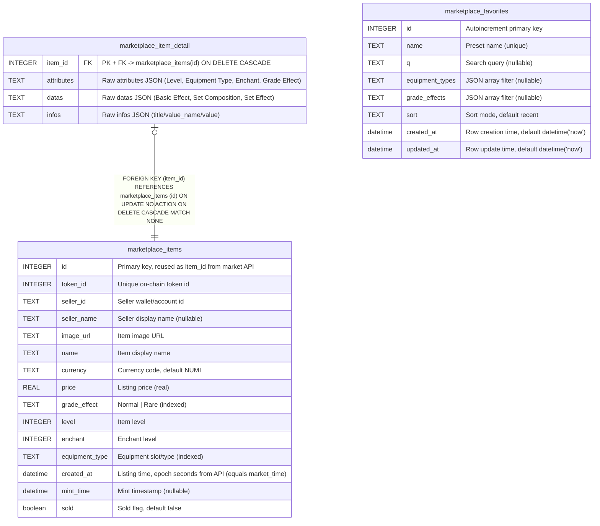

# ghostmplay

## Description

Windows desktop marketplace — SQLite (TypeORM 0.3 + sqljs, dev file ./ghostmplay.db)

## Tables

| Name | Columns | Comment | Type |
| ---- | ------- | ------- | ---- |
| [marketplace_item_detail](marketplace_item_detail.md) | 4 | 1-1 detail of marketplace_items, raw jsonb mirrors kept for fidelity | table |
| [marketplace_items](marketplace_items.md) | 15 | Listing snapshot, mirrors note.txt (id reused as item_id from market API) | table |
| [marketplace_favorites](marketplace_favorites.md) | 8 | Saved filter presets in UI, no FK to items | table |

## Relations

---

> Generated by [tbls](https://github.com/k1LoW/tbls)
