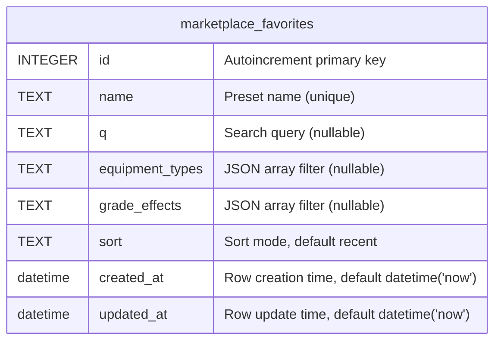

# marketplace_favorites

## Description

Saved filter presets in UI, no FK to items

<details>
<summary><strong>Table Definition</strong></summary>

```sql
CREATE TABLE "marketplace_favorites" ("id" integer PRIMARY KEY AUTOINCREMENT NOT NULL, "name" text NOT NULL, "q" text, "equipment_types" text, "grade_effects" text, "sort" text NOT NULL DEFAULT ('recent'), "created_at" datetime NOT NULL DEFAULT (datetime('now')), "updated_at" datetime NOT NULL DEFAULT (datetime('now')))
```

</details>

## Columns

| Name | Type | Default | Nullable | Children | Parents | Comment |
| ---- | ---- | ------- | -------- | -------- | ------- | ------- |
| id | INTEGER |  | false |  |  | Autoincrement primary key |
| name | TEXT |  | false |  |  | Preset name (unique) |
| q | TEXT |  | true |  |  | Search query (nullable) |
| equipment_types | TEXT |  | true |  |  | JSON array filter (nullable) |
| grade_effects | TEXT |  | true |  |  | JSON array filter (nullable) |
| sort | TEXT | 'recent' | false |  |  | Sort mode, default recent |
| created_at | datetime | datetime('now') | false |  |  | Row creation time, default datetime('now') |
| updated_at | datetime | datetime('now') | false |  |  | Row update time, default datetime('now') |

## Constraints

| Name | Type | Definition |
| ---- | ---- | ---------- |
| id | PRIMARY KEY | PRIMARY KEY (id) |

## Indexes

| Name | Definition |
| ---- | ---------- |
| IDX_8321a0f29001640e8af72236b6 | CREATE UNIQUE INDEX "IDX_8321a0f29001640e8af72236b6" ON "marketplace_favorites" ("name")  |

## Relations



---

> Generated by [tbls](https://github.com/k1LoW/tbls)
