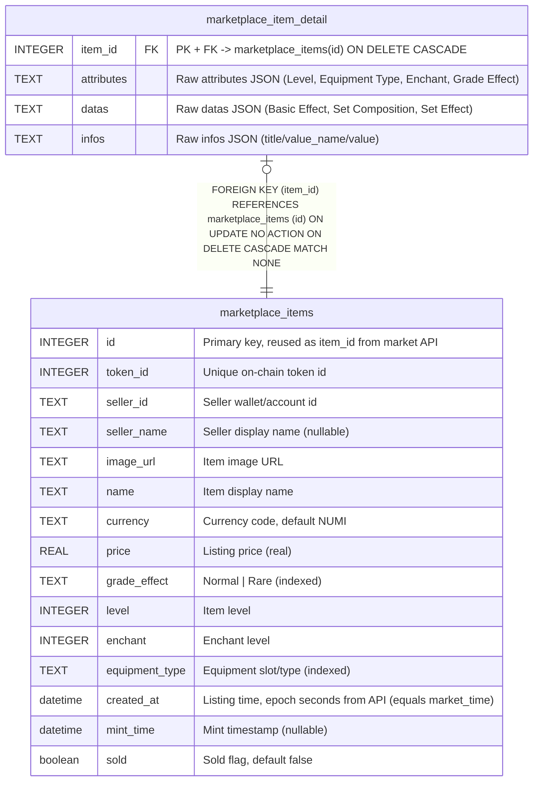

# marketplace_item_detail

## Description

1-1 detail of marketplace_items, raw jsonb mirrors kept for fidelity

<details>
<summary><strong>Table Definition</strong></summary>

```sql
CREATE TABLE "marketplace_item_detail" ("item_id" integer PRIMARY KEY NOT NULL, "attributes" text, "datas" text, "infos" text, CONSTRAINT "FK_62098a83a9594784fd984404f34" FOREIGN KEY ("item_id") REFERENCES "marketplace_items" ("id") ON DELETE CASCADE ON UPDATE NO ACTION)
```

</details>

## Columns

| Name | Type | Default | Nullable | Children | Parents | Comment |
| ---- | ---- | ------- | -------- | -------- | ------- | ------- |
| item_id | INTEGER |  | false |  | [marketplace_items](marketplace_items.md) | PK + FK -\> marketplace_items(id) ON DELETE CASCADE |
| attributes | TEXT |  | true |  |  | Raw attributes JSON (Level, Equipment Type, Enchant, Grade Effect) |
| datas | TEXT |  | true |  |  | Raw datas JSON (Basic Effect, Set Composition, Set Effect) |
| infos | TEXT |  | true |  |  | Raw infos JSON (title/value_name/value) |

## Constraints

| Name | Type | Definition |
| ---- | ---- | ---------- |
| item_id | PRIMARY KEY | PRIMARY KEY (item_id) |
| - (Foreign key ID: 0) | FOREIGN KEY | FOREIGN KEY (item_id) REFERENCES marketplace_items (id) ON UPDATE NO ACTION ON DELETE CASCADE MATCH NONE |

## Relations



---

> Generated by [tbls](https://github.com/k1LoW/tbls)
