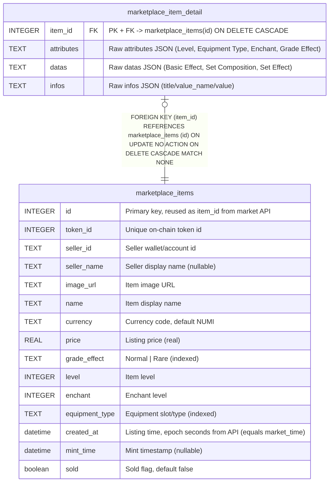

# marketplace_items

## Description

Listing snapshot, mirrors note.txt (id reused as item_id from market API)

<details>
<summary><strong>Table Definition</strong></summary>

```sql
CREATE TABLE "marketplace_items" ("id" integer PRIMARY KEY NOT NULL, "token_id" integer NOT NULL, "seller_id" text NOT NULL, "seller_name" text, "image_url" text NOT NULL, "name" text NOT NULL, "currency" text NOT NULL DEFAULT ('NUMI'), "price" real NOT NULL, "grade_effect" text NOT NULL, "level" integer NOT NULL, "enchant" integer NOT NULL, "equipment_type" text NOT NULL, "created_at" datetime NOT NULL, "mint_time" datetime, "sold" boolean NOT NULL DEFAULT (0))
```

</details>

## Columns

| Name | Type | Default | Nullable | Children | Parents | Comment |
| ---- | ---- | ------- | -------- | -------- | ------- | ------- |
| id | INTEGER |  | false | [marketplace_item_detail](marketplace_item_detail.md) |  | Primary key, reused as item_id from market API |
| token_id | INTEGER |  | false |  |  | Unique on-chain token id |
| seller_id | TEXT |  | false |  |  | Seller wallet/account id |
| seller_name | TEXT |  | true |  |  | Seller display name (nullable) |
| image_url | TEXT |  | false |  |  | Item image URL |
| name | TEXT |  | false |  |  | Item display name |
| currency | TEXT | 'NUMI' | false |  |  | Currency code, default NUMI |
| price | REAL |  | false |  |  | Listing price (real) |
| grade_effect | TEXT |  | false |  |  | Normal \| Rare (indexed) |
| level | INTEGER |  | false |  |  | Item level |
| enchant | INTEGER |  | false |  |  | Enchant level |
| equipment_type | TEXT |  | false |  |  | Equipment slot/type (indexed) |
| created_at | datetime |  | false |  |  | Listing time, epoch seconds from API (equals market_time) |
| mint_time | datetime |  | true |  |  | Mint timestamp (nullable) |
| sold | boolean | 0 | false |  |  | Sold flag, default false |

## Constraints

| Name | Type | Definition |
| ---- | ---- | ---------- |
| id | PRIMARY KEY | PRIMARY KEY (id) |

## Indexes

| Name | Definition |
| ---- | ---------- |
| IDX_3f8a2d74e216b10ca1daeb3002 | CREATE UNIQUE INDEX "IDX_3f8a2d74e216b10ca1daeb3002" ON "marketplace_items" ("token_id")  |
| IDX_79de7415f71cc395a1b623778b | CREATE INDEX "IDX_79de7415f71cc395a1b623778b" ON "marketplace_items" ("grade_effect")  |
| IDX_3a77c57f68f4f443b0d0ca6198 | CREATE INDEX "IDX_3a77c57f68f4f443b0d0ca6198" ON "marketplace_items" ("equipment_type")  |

## Relations



---

> Generated by [tbls](https://github.com/k1LoW/tbls)
